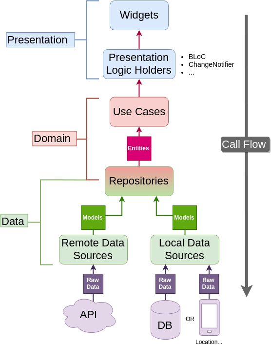

# Weather Task

A weather app built using Test-Driven Development (TDD) and clean architecture principles.

## Features

- Fetches current weather information
- Clean and maintainable codebase using TDD
- Follows clean architecture for better separation of concerns

## Technologies Used

- bloc
- dio
  - pretty dio logger
- cached network image
- get_it
- rxdart
- equatable
- dartz


## Installation

1. Clone the repository:
   ```bash
   git clone https://github.com/moha-b/Weather-Task.git
   cd Weather-Task
   ```

2. Install dependencies:
   ```bash
   flutter pub get
   ```

3. Run the app:
   ```bash
   flutter run
   ```
4. In the network folder go to [network helper](lib/core/network/network_helper.dart) replace `Api.key` with your key u can get on from here [get api key](https://home.openweathermap.org/users/sign_in)
```dart
params['appid'] = Api.key;
```

## Project Structure



## preview

[Screen_recording_20240611_210101.mp4](..%2F..%2F..%2F..%2FScreen_recording_20240611_210101.mp4)